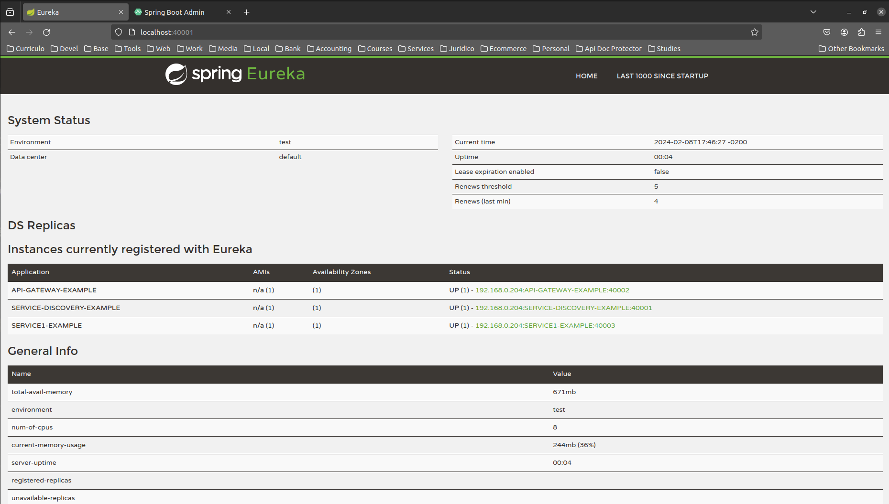
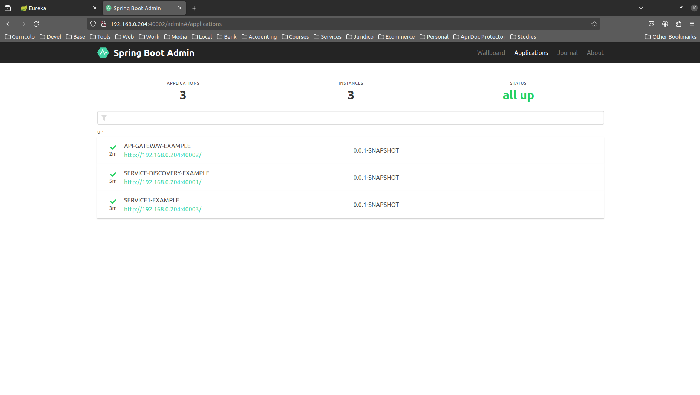
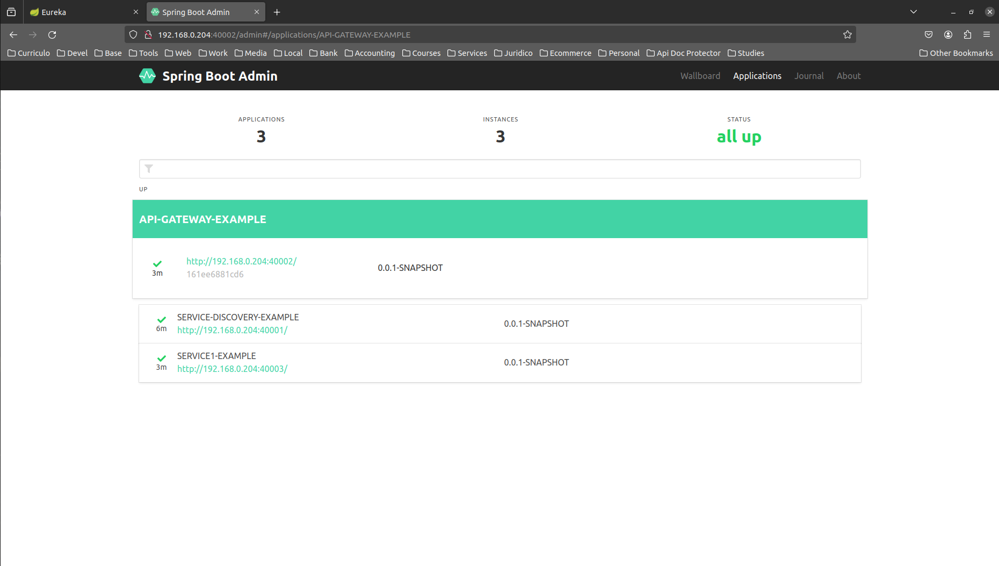
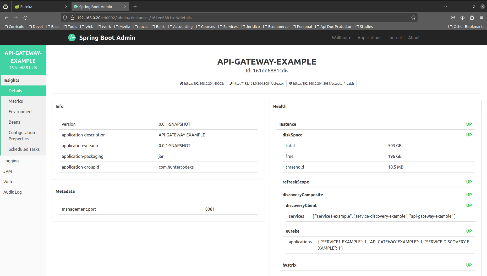
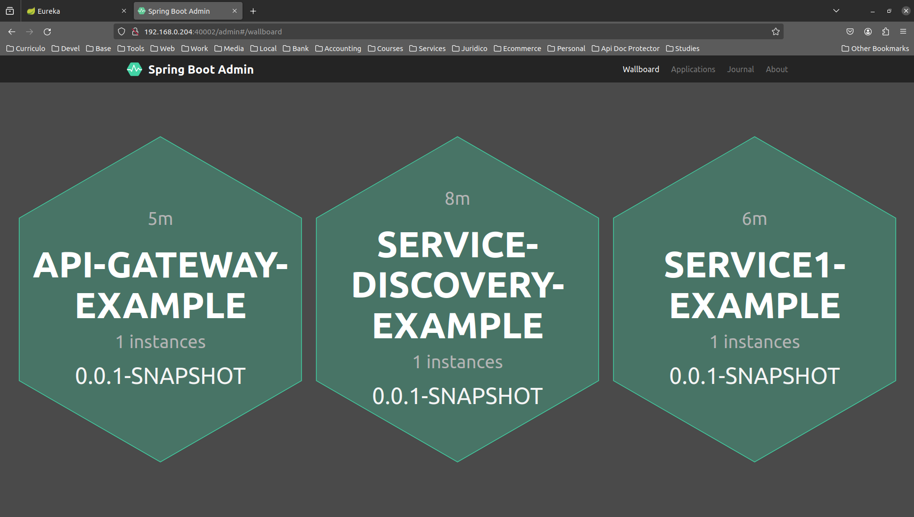

# SPRING BOOT ADMIN DEMO
Spring Boot Admin Sample Project

> **NOTE:** 
> This project have the main purpose offer a fast overview about the Spring Boot Admin Tools for environments that
> use the Eureka Service Discovery and Api Gateway Zuul

# Using this sample project - Step by Step

> NOTE: 
> Make sure you are using the Java 1.8 or later

To use this repository correctly, please follow the below instructions

1- Clone it from huntercodexs GitHUB account

<pre>
user@host:/home/user$ git clone https://github.com/huntercodexs/spring-boot-admin-demo.git .
</pre>

2- Prepare each project to generate a executable jar file

- Check the pom.xml file
- Check the application.properties file

3- Make a required or needed changes in the project code

4- Run each application in the following order

- ServiceDiscoveryExample
- Service1Example
- ApiGatewayExample

5- Check the Eureka Service Discovery after that all services are running correctly in http://localhost:40001/

6- Check all details from each application registered in the Eureka Service Discovery by Spring Boot Admin in the link http://192.168.0.204:40002/admin#/applications

7- If it's needed, you can make a request to Service Example 1 to have a sure that all the things are good

[SPRING-BOOT-ADMIN-DEMO.postman_collection.json](resources/postman/SPRING-BOOT-ADMIN-DEMO.postman_collection.json)

...